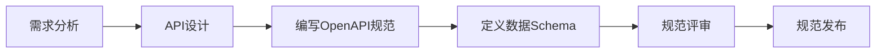
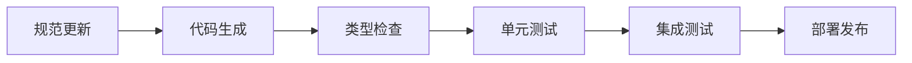
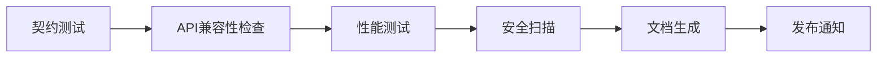

# AI SRE 项目规范约束

本目录包含AI SRE分身助理项目的所有API规范、数据模型定义和约束机制，确保整个项目的架构和标准统一。

## 规范体系架构

```
specs/
├── openapi/              # OpenAPI 3.0 规范
│   ├── agent-api.yaml    # Agent编排层API规范
│   ├── mcp-tools.yaml    # MCP工具集API规范
│   ├── web-api.yaml      # Web控制台API规范
│   └── common/           # 通用组件定义
│       ├── schemas.yaml  # 数据模型定义
│       ├── responses.yaml # 响应模板
│       └── parameters.yaml # 参数定义
├── proto/                # gRPC Protocol Buffers
│   ├── agent/           # Agent服务定义
│   ├── mcp/             # MCP工具协议
│   └── common/          # 通用消息定义
├── schemas/             # JSON Schema定义
│   ├── config/          # 配置文件Schema
│   ├── events/          # 事件消息Schema
│   └── data/            # 数据模型Schema
├── contracts/           # 服务契约测试
├── generators/          # 代码生成器
└── validators/          # 规范验证器
```

## 核心设计原则

### 1. API First 设计
- 所有API必须先定义OpenAPI规范，再实现代码
- 使用规范生成客户端SDK和服务端桩代码
- 强制API版本管理和向后兼容

### 2. Schema Driven 开发
- 所有数据结构使用JSON Schema定义
- 配置文件、消息格式统一验证
- 自动生成数据模型代码

### 3. Contract Testing
- 服务间通信使用契约测试
- 确保API规范与实现一致
- 自动化集成测试验证

### 4. 多语言支持
- 规范支持Python、Go、TypeScript等多语言生成
- 统一的错误码和消息格式
- 跨语言类型映射标准化

## 技术栈选择

### OpenAPI 3.0
- **用途**: REST API规范定义
- **工具**: Swagger Codegen, OpenAPI Generator
- **验证**: Spectral, Swagger Validator

### Protocol Buffers
- **用途**: gRPC服务定义和高性能通信
- **工具**: protoc, buf
- **语言**: Python, Go, TypeScript

### JSON Schema
- **用途**: 数据模型和配置验证
- **工具**: ajv, jsonschema
- **标准**: Draft 2020-12

## 工作流程

### 1. 规范定义阶段


### 2. 代码生成阶段


### 3. 验证测试阶段


## 规范管理

### 版本控制
- 使用语义化版本 (Semantic Versioning)
- 主版本号：不兼容的API修改
- 次版本号：向下兼容的功能性新增
- 修订号：向下兼容的问题修正

### 变更管理
- 所有规范变更必须通过PR审核
- 重大变更需要架构委员会批准
- 提供变更影响分析报告

### 文档生成
- 自动生成API文档
- 多格式输出：HTML、PDF、Markdown
- 集成到CI/CD流程

## 工具链集成

### 开发工具
- **VS Code插件**: OpenAPI、Protocol Buffers语法高亮
- **IDE集成**: 实时规范验证和代码补全
- **Git Hooks**: 提交前规范检查

### CI/CD集成
- **规范验证**: 每次提交自动验证规范格式
- **代码生成**: 自动生成客户端和服务端代码
- **测试执行**: 自动运行契约测试和集成测试
- **文档发布**: 自动更新API文档站点

### 监控告警
- **规范漂移检测**: 监控实际API与规范的偏差
- **性能监控**: 基于规范的SLA监控
- **兼容性告警**: API变更影响评估

## 最佳实践

### API设计
1. **RESTful设计**: 遵循REST架构风格
2. **资源导向**: 以资源为中心设计API
3. **HTTP状态码**: 正确使用HTTP状态码
4. **错误处理**: 统一的错误响应格式
5. **分页排序**: 标准化的分页和排序参数

### 数据模型
1. **命名规范**: 使用驼峰命名法
2. **类型安全**: 严格的类型定义
3. **必填字段**: 明确标识必填和可选字段
4. **默认值**: 合理设置默认值
5. **验证规则**: 完整的数据验证约束

### 文档编写
1. **详细描述**: 每个API都有清晰的描述
2. **示例代码**: 提供完整的请求/响应示例
3. **错误说明**: 详细的错误码和处理建议
4. **使用场景**: 说明API的典型使用场景
5. **变更日志**: 记录所有版本变更

## 快速开始

### 1. 安装工具
```bash
# 安装OpenAPI工具
npm install -g @apidevtools/swagger-cli
npm install -g @openapitools/openapi-generator-cli

# 安装Protocol Buffers工具
# macOS
brew install protobuf buf

# 安装验证工具
npm install -g @stoplight/spectral-cli
```

### 2. 验证规范
```bash
# 验证OpenAPI规范
spectral lint specs/openapi/agent-api.yaml

# 验证Protocol Buffers
buf lint specs/proto/

# 生成代码
make generate-all
```

### 3. 运行测试
```bash
# 契约测试
make contract-test

# 集成测试
make integration-test
```

## 规范示例

详细的规范示例请参考：
- [Agent API规范](openapi/agent-api.yaml)
- [MCP工具规范](openapi/mcp-tools.yaml)
- [gRPC协议定义](proto/agent/agent.proto)
- [数据模型Schema](schemas/data/models.json)

## 贡献指南

1. **规范设计**: 遵循API First原则
2. **代码审查**: 所有规范变更需要代码审查
3. **测试覆盖**: 确保规范有对应的测试用例
4. **文档更新**: 及时更新相关文档
5. **向后兼容**: 保持API向后兼容性